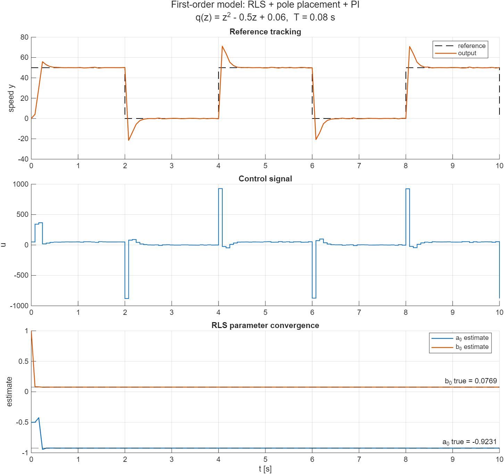
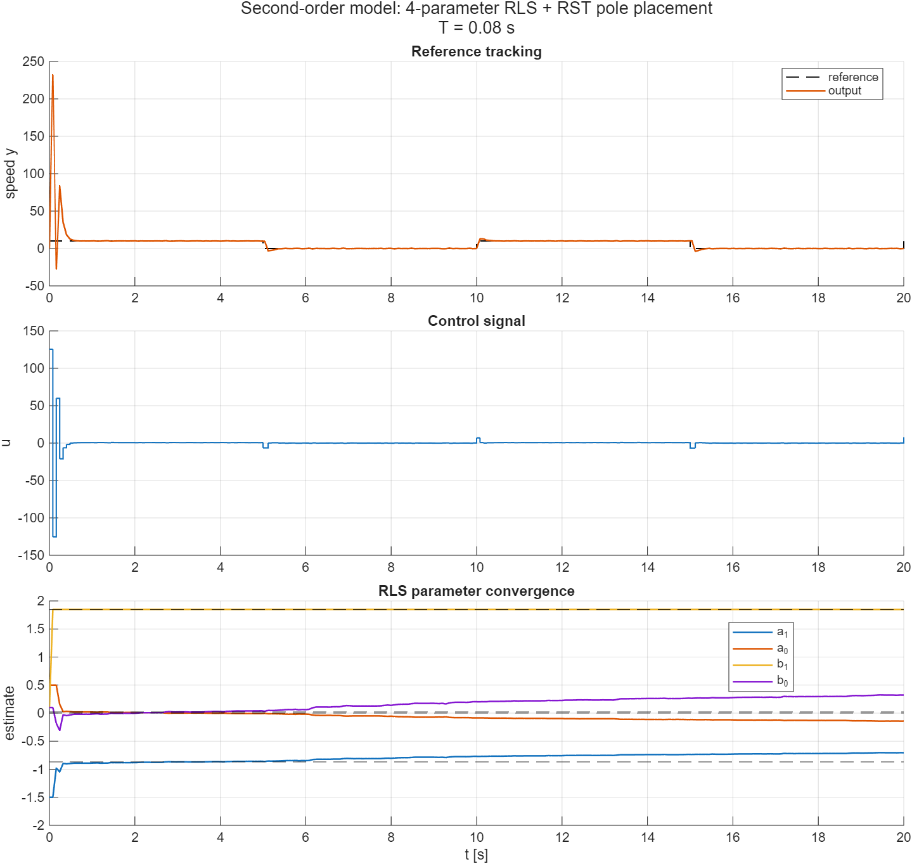
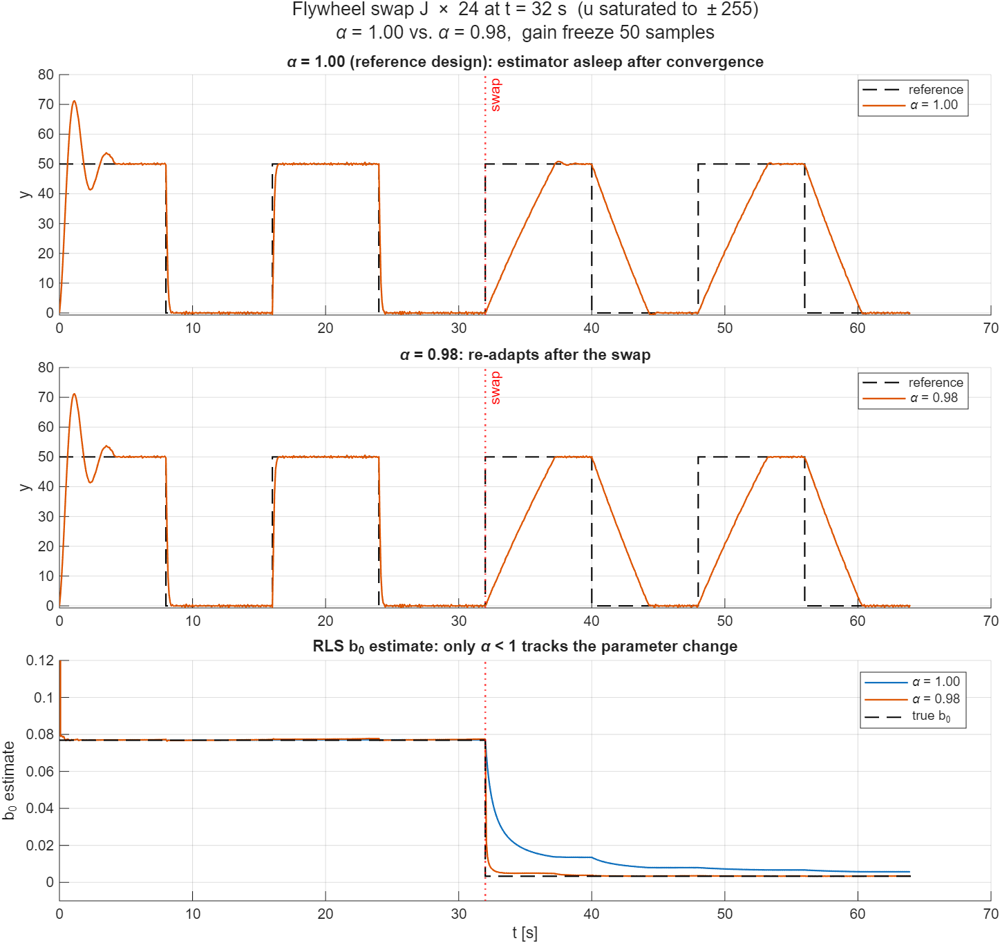
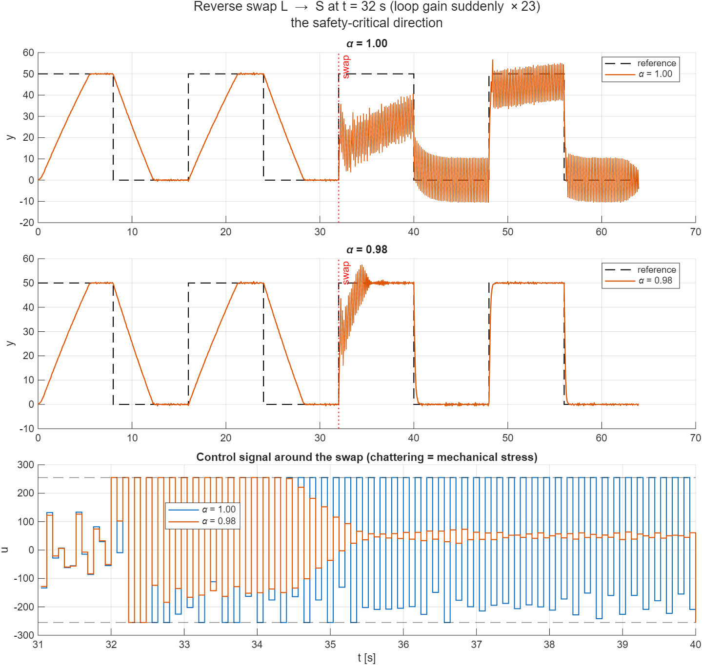
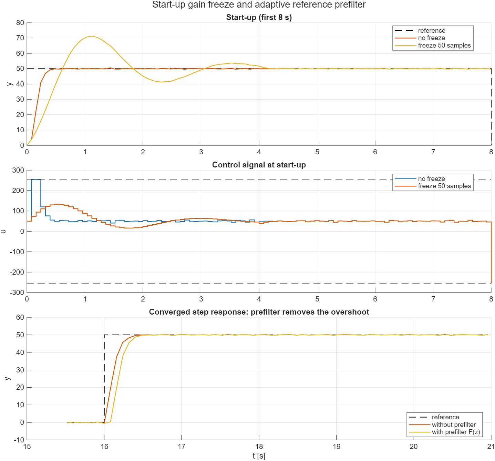
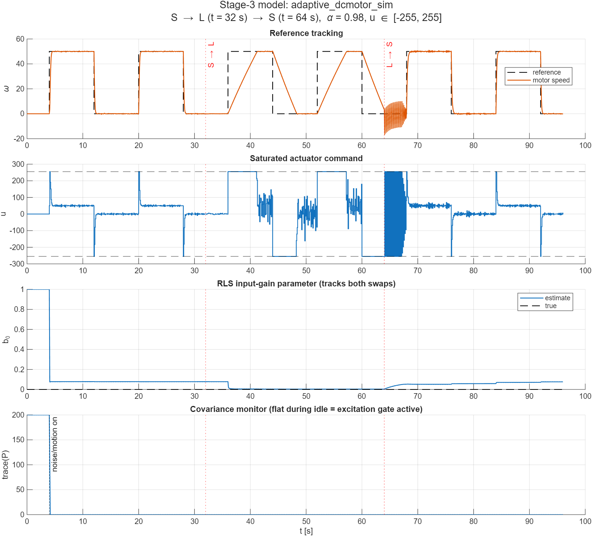
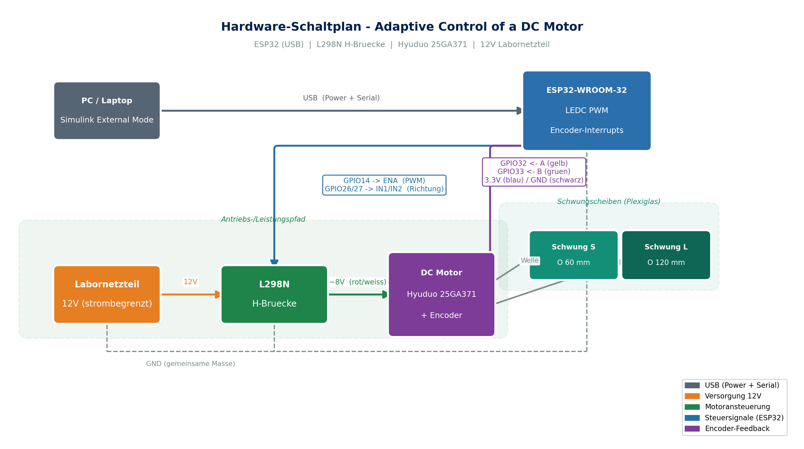
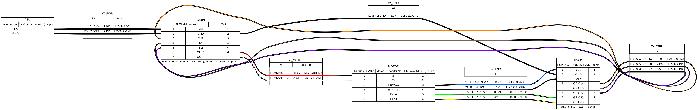

# Adaptive Control of a DC Motor

Physical lab demonstration of **adaptive speed control** for a DC motor — Example 7.6, *Advanced Control Engineering II* (MCI Innsbruck). A recursive-least-squares (RLS) estimator identifies the discrete-time motor model online; a pole-placement design continuously re-tunes the controller. The controller runs on an **ESP32** via Simulink External Mode and drives a Hyuduo 25GA371 DC motor through an L298N H-bridge.

The headline demonstration is the RLS estimate adapting online to a **24× inertia jump** from the small flywheel (J = 1.5×10⁻⁵ kgm²) to the large one (J = 3.6×10⁻⁴ kgm²): the estimates re-converge and the closed-loop settling time stays ≈ 250 ms without any manual re-tuning. Because the flywheels cannot be mounted for the submission, the physical test bench runs the bare motor and the flywheel swap is demonstrated in `adaptive_dcmotor_sim.slx` with the S → L → S scenario.

## Control algorithm

### First-order design (RLS + pole placement + PI)

The motor is modeled as a discrete-time first-order system at sample time **T = 0.08 s**:

```
G(z) = b₀ / (z + a₀)
```

Three blocks run each sample step (source of truth: [firmware_model/](firmware_model/), verbatim mirror of the reference simulation):

**1. RLS estimator** ([firmware_model/rls_estimator.m](firmware_model/rls_estimator.m)) — estimates `[a₀; b₀]` from the previous input/output:

```
C = [-y(k-1), u(k-1)]
L = P·Cᵀ / (C·P·Cᵀ + α)
xe = xe + L·(y(k) − C·xe)
P = (I − L·C)·P / α
```

Init: `P = 100·I`, `xe = [-0.5; 1.0]`, forgetting factor `α = 1.0`.

**2. Pole placement** ([firmware_model/pole_placement_controller.m](firmware_model/pole_placement_controller.m)) — places the closed-loop poles at the roots of `q(z) = z² − 0.5z + 0.06` (settling ≈ 250 ms at T = 0.08 s):

```
d₀ = (q₀ + a₀) / b₀        q₀ = 0.06
d₁ = (q₁ + 1 − a₀) / b₀    q₁ = −0.5
```

**3. Incremental PI controller** ([firmware_model/PI_C.m](firmware_model/PI_C.m)):

```
u(k) = u(k−1) + d₁·e(k) + d₀·e(k−1)
```

On the ESP32, `u` is saturated to [−255, 255]; the *saturated* value feeds back as `u(k−1)` (anti-windup-consistent).

### Second-order design (4-parameter RLS + RST pole placement)

The second reference model identifies a full second-order motor model (electrical + mechanical dynamics),

```
G(z) = (b₁z + b₀) / (z² + a₁z + a₀)
```

with a 4-parameter RLS (`P = 100·I₄`) and an RST-type control law

```
u(k) = (1 − r₁)·u(k−1) + r₁·u(k−2) + s₀·e(k) + s₁·e(k−1) + s₂·e(k−2)
```

whose gains `r₁, s₀, s₁, s₂` are recomputed each step by solving a 4×4 Sylvester (Diophantine) system; when the system becomes near-singular (|det| ≤ 10⁻⁴, e.g. before the estimates have converged), the previous gains are held.

## Simulation results

Both reference models were run headlessly ([matlab/export_sim_plots.m](matlab/export_sim_plots.m), MATLAB R2025b) with per-step overshoot/settling metrics computed from the logged signals.

### First-order model



Simulink diagram: [img/model_1st.png](img/model_1st.png) — reference: ±50 square wave (period 4 s), plant `Km/(Js+b)` with `Km = J = b = 1`, measurement noise, T = 0.08 s, 10 s horizon.

| Metric | Result | Design target |
|---|---|---|
| RLS convergence | a₀ = −0.9234 (true −0.9231), b₀ = 0.0767 (true 0.0769) — converged after ≈ 0.3 s | ✅ exact |
| Settling time (2 % band) | ≈ 0.40 s per step | ≈ 0.25 s — close |
| Overshoot | **≈ 42 % on every step** (after convergence) | ❌ spec was "no overshoot" |

**Why the overshoot happens although q(z) = (z − 0.2)(z − 0.3) has two real, non-oscillatory poles:** the incremental PI adds a closed-loop **zero**. The closed loop is

```
H(z) = b₀(d₁z + d₀) / q(z),   zero at z₀ = −d₀/d₁ ≈ 0.61
```

and with the converged estimates this zero lies *right* of both poles (0.2, 0.3), which produces the ≈ 42 % peak. The lecture script acknowledges exactly this effect: Example 7.6 (aut5.pdf, p. 107) compares the motor output against the desired response `T(z) = q(1)/q(z)` and notes the deviation as a *"phase error due to the different numerator order"* — the experimental figure there (Abram & Fieg, RF 370-16300 + Arduino Due) shows the same lead/overshoot at every reference edge plus a large initial learning spike. So the reference simulation is faithful to the script; "no overshoot" was never achievable with this structure. It is **structural for the 1-DOF design**: for this plant, z₀ ≥ p holds for any pole choice p ∈ (0, 1), with equality only when the closed-loop pole is placed on the open-loop pole (no speed-up). Re-tuning q₀/q₁ alone therefore cannot remove the overshoot — it needs a 2-DOF structure, e.g. an adaptive reference prefilter

```
F(z) = (1 − z₀) / (z − z₀),   z₀ = −d₀/d₁  (recomputed each step)
```

which cancels the zero and leaves the pure two-pole response (no overshoot, ~0.3 s settling) — this makes the numerator order match the desired `T(z)`, i.e. it removes precisely the "phase error" named in the script. This is a candidate improvement for the ESP32 model (one extra block; the reference simulation is left untouched).

Two further notes from the script:

- **Start-up practice (Example 7.5, p. 104):** in the script's self-tuning-regulator experiment the estimated parameters are *"applied to pole placement only after the first 50 iterations"*. The reference simulation closes the adaptive loop from k = 0 instead, which is what causes the `u` spikes (≈ ±900) and the large initial output excursion. For the ESP32 (where u saturates at ±255) the gains should be frozen for the first ~50 samples (≈ 4 s at T = 0.08 s) while RLS learns.
- **b₀ formula:** the script states `b₀ = Km/J`, which is a simplification. The exact ZOH discretization gives `b₀ = (Km/b)(1 − e^(−bT/J))` (≈ Km·T/J for bT/J ≪ 1) — for the simulation parameters that is 0.0769, and this is the value the RLS converges to.

### Second-order model



Simulink diagram: [img/model_2nd.png](img/model_2nd.png) — reference: ±10 square wave (period 10 s), full electrical+mechanical plant `Km/(L_aJs² + (L_ab + R_aJ)s + (R_ab + Km²))`, 20 s horizon.

- **Tracking works**: after the initial adaptation transient (first ≈ 0.6 s, where the wrong initial estimates cause a large output excursion), the output follows the reference with ≈ 0.4 s settling; overshoot ≈ 30 % at later steps (same closed-loop-zero mechanism as above).
- **RLS estimates do not converge to the true ZOH parameters** (e.g. b₀ = 0.32 vs. true 0.02) and keep drifting slowly. Cause: the true discrete plant has a near pole-zero cancellation (fast electrical pole maps to z ≈ 0, plant zero at z ≈ −0.01), so a square-wave input does not excite the system enough to identify 4 parameters uniquely. The estimated model is input-output-equivalent along the trajectory, which is why pole placement still yields a working controller — a textbook illustration that *adaptive control needs certainty equivalence, not true-parameter convergence*.
- The Sylvester-system det-guard (hold last gains when |det M| ≤ 10⁻⁴) keeps the loop alive during the poorly-identified initial phase.

### Design study for the ESP32 implementation

The reference simulation runs with an unbounded actuator. [matlab/design_study.m](matlab/design_study.m) re-simulates the first-order loop under **realistic ESP32 conditions** (u saturated to ±255, saturated value fed back) and tests the open design decisions, including the flywheel-swap demo (J ×24) in **both directions**. Results:

| Decision | Finding | Consequence |
|---|---|---|
| **Forgetting factor α** | With α = 1.00 the estimator gain decays to zero: after S → L the estimates stop tracking, and after the reverse swap **L → S the loop ends in a permanent limit cycle** (u chatters at ≈ 12 sign changes/s — mechanical and H-bridge stress, never settles). With **α = 0.98** the loop re-adapts within ≈ 2.5 s and returns to the designed 0.4 s / ≈1 % behavior from the next step on. | **Change α from 1.0 → 0.98** (required for the demo) |
| **Overshoot / prefilter** | The ±255 saturation slew-limits large reference steps, which removes the closed-loop-zero overshoot in practice: ≈ 1 % instead of the 42 % seen with an unbounded actuator. The adaptive prefilter brings no further benefit at demo amplitudes and only adds delay. It matters only for small steps that do not saturate u. | Prefilter **not needed** (keep as documented option) |
| **Start-up gain freeze** | Freezing the controller gains for 50 samples (the lecture's Example 7.5 practice) is counterproductive here: the frozen initial-guess gains ring for ~4 s (peak 71 at ref 50), while the unfrozen loop converges within ≈ 0.4 s because saturation already bounds u and RLS learns in a few samples. | **No freeze**; keep the **b₀ guard** (hold gains while |b₀ₑ| < threshold) instead |







Recommended ESP32 parameter set: `α = 0.98`, `P₀ = 100·I`, `x̂₀ = [−0.5; 1.0]`, `q(z) = z² − 0.5z + 0.06`, u clamped to ±255 with the saturated value as `u(k−1)`, gain update guarded by `|b₀ₑ| > ε`. One caution for the hardware phase: α < 1 without excitation can cause covariance windup (P grows during long constant-speed phases, then a noise burst can trigger an estimate jump — "bursting"). The demo's periodic reference steps provide excitation; if the motor runs at constant speed for long periods, consider a ceiling on trace(P) or pausing the P-update at steady state.

### Stage models for the ESP32

Three script-built, validated models are available in `simulink/`: `encoder_test.slx` (stage 2), `adaptive_dcmotor_sim.slx` (the stage-3 controller against a simulated plant in an S → L → S flywheel-swap scenario, covering the inertia demonstration not run on hardware), and `adaptive_dcmotor.slx` (stage 3 on ESP32 I/O in External Mode).

The models implement the decisions from the [design study](#design-study-for-the-esp32-implementation): `α = 0.98`, an RLS excitation gate that pauses the P-update without excitation to prevent covariance windup at idle, a b₀ guard, and saturation at ±255 with the saturated `u` fed back.



The idle start remains flat because of the excitation gate. In the simulated S → L → S inertia demonstration, which is not run on hardware, the estimator re-adapts after both flywheel swaps, with no limit cycle after L → S.

The builder is [matlab/build_stage_models.m](matlab/build_stage_models.m), and the validator is [matlab/validate_stage_models.m](matlab/validate_stage_models.m). To reproduce the models and validation from WSL:

```bash
STAGE=/mnt/c/Users/Lenard/AppData/Local/Temp/ace_sim_export
mkdir -p "$STAGE"
cp matlab/build_stage_models.m matlab/validate_stage_models.m "$STAGE/"
cp ACE-II-AdaptiveControl/pwm_test.slx "$STAGE/"   # read-only config donor
"/mnt/c/Program Files/MATLAB/R2025b/bin/matlab.exe" -wait -nosplash \
   -sd 'C:\Users\Lenard\AppData\Local\Temp\ace_sim_export' \
   -logfile 'C:\Users\Lenard\AppData\Local\Temp\ace_sim_export\build.log' \
   -batch "build_stage_models"        # grep BUILD_OK
# then -batch "validate_stage_models" # grep VALIDATION_OK
```

See [simulink/README.md](simulink/README.md) for the handover guide.

### Reproducing the plots

Both models were saved with **MATLAB R2025b**. From WSL, with Windows MATLAB installed:

```bash
STAGE=/mnt/c/Users/Lenard/AppData/Local/Temp/ace_sim_export
mkdir -p "$STAGE"
cp "ACE-II-AdaptiveControl/First Order Model/ACE_II_AC_1oDCMotor.slx" \
   "ACE-II-AdaptiveControl/Second Order Model/ACE_II_AC_DCMotor.slx" \
   matlab/export_sim_plots.m "$STAGE/"
"/mnt/c/Program Files/MATLAB/R2025b/bin/matlab.exe" -wait -nosplash \
   -sd 'C:\Users\Lenard\AppData\Local\Temp\ace_sim_export' \
   -logfile 'C:\Users\Lenard\AppData\Local\Temp\ace_sim_export\run.log' \
   -batch "export_sim_plots"
cp "$STAGE"/simulation_*.png "$STAGE"/model_*.png img/
```

[matlab/export_sim_plots.m](matlab/export_sim_plots.m) enables signal logging programmatically (the models ship without logging), runs both simulations, exports the plots and prints per-step overshoot/settling metrics to `run.log`. The models are never modified.

## Hardware

| Component | Part | Notes |
|---|---|---|
| Motor | Hyuduo 25GA371, 12 V | integrated quadrature encoder (6 wires) |
| MCU | ESP32 DevKit (WROOM) | power backpack shield, DC 6.5–16 V barrel jack |
| Driver | L298N H-bridge | ~4 V drop → at 12 V supply the motor sees ~8 V |
| Flywheel S | plexiglass Ø60 mm × 10 mm | J = 1.5×10⁻⁵ kgm² (design option, not mounted for submission — demonstrated in simulation) |
| Flywheel L | plexiglass Ø120 mm × 15 mm | J = 3.6×10⁻⁴ kgm² (24 : 1 vs. S; design option, not mounted for submission — demonstrated in simulation) |

### GPIO pinout

| Signal | ESP32 pin | Notes |
|---|---|---|
| ENA (PWM) | GPIO 14 | LEDC channel — `analogWrite()` does not exist on ESP32 |
| IN1 (direction) | GPIO 26 | `u ≥ 0`: IN1 = 1, IN2 = 0 |
| IN2 (direction) | GPIO 27 | `u < 0`: IN1 = 0, IN2 = 1 |
| Encoder A | GPIO 32 | interrupt / PCNT |
| Encoder B | GPIO 33 | interrupt / PCNT |
| Encoder VCC | 3.3 V | **not 5 V** — ESP32 GPIOs are not 5 V-tolerant |

This pin map follows the colleague's ESP32 model proven on real hardware (2026-07-06); the earlier draft pins 25/18/19 are obsolete.

Speed from encoder counts: `ω(k) = 2π·ΔN / (T·CPR)` with CPR ≈ 44 (11 PPR × 4 quadrature — verify in the lab). The colleague's model uses an effective 11 counts/rev (`2π/11` gain) — a factor-4 discrepancy to be resolved by the one-revolution test in [firmware_model/TESTPLAN.md](firmware_model/TESTPLAN.md), stage 2.





Full part list, wiring details and mechanical parts: [BOM.md](BOM.md) · [hardware_diagram.md](hardware_diagram.md) · [schaltplan.drawio](schaltplan.drawio) · [wiring.yml](wiring.yml)

## Repository structure

```
AdaptiveControlDC/
├── ACE-II-AdaptiveControl/     # Reference simulation (Felix Raffl) — nested git repo
│   ├── First Order Model/      #   ACE_II_AC_1oDCMotor.slx + init .mlx
│   └── Second Order Model/     #   ACE_II_AC_DCMotor.slx + init .mlx
├── firmware_model/             # ESP32 controller spec — the 3 MATLAB Function blocks
│   ├── rls_estimator.m         #   (verbatim from the reference model), I/O mapping
│   ├── pole_placement_controller.m
│   ├── PI_C.m
│   ├── README.md               #   ESP32 I/O spec (PWM, PCNT encoder, saturation)
│   └── TESTPLAN.md             #   3-stage incremental bring-up plan
├── matlab/
│   ├── export_sim_plots.m      # Headless simulation + plot export (this README's figures)
│   ├── build_stage_models.m    # Build the three staged Simulink models
│   ├── validate_stage_models.m # Validate the generated stage models
│   └── design_study.m          # ESP32 design-decision simulations
├── simulink/                 # Script-built ESP32 stage models
│   ├── encoder_test.slx        # Stage 2: encoder speed measurement
│   ├── adaptive_dcmotor_sim.slx # Stage-3 controller with simulated plant
│   ├── adaptive_dcmotor.slx    # Stage 3: ESP32 I/O and External Mode
│   └── README.md               # Handover guide
├── img/                        # Figures (hardware diagram, wiring, simulation results)
├── BOM.md                      # Bill of materials + wiring
└── Task_Description.md         # Task spec (German)
```

## ESP32 firmware bring-up

The firmware is built **incrementally in Simulink External Mode** (Monitor & Tune), one stage at a time — see [firmware_model/TESTPLAN.md](firmware_model/TESTPLAN.md):

1. **`pwm_test.slx`** — PWM open-loop: slider → LEDC PWM on GPIO 14, direction pins fixed. Done by the colleague and verified on hardware.
2. **`encoder_test.slx`** — encoder → ω: PCNT counts → ΔN → `2π/(T·CPR)`. Calibrate CPR by turning the shaft exactly one revolution. The finished model is in `simulink/`.
3. **`adaptive_dcmotor.slx`** — close the loop: RLS + pole placement + PI between sensor and actuator, saturation ±255, tunable ω_ref. The finished model is in `simulink/`.

Safety checklist for every powered test: current limit on the bench supply (start 0.5 A), common ground ESP32 ↔ L298N ↔ supply, encoder on 3.3 V, ENA jumper removed, motor mechanically fixed.

## Further reading

A literature review on adaptive control (standard textbooks, key papers, and how they judge this project's design choices) is in [Literaturrecherche_Adaptive_Control.md](Literaturrecherche_Adaptive_Control.md) (German). Highlight: Landau et al., *Adaptive Control* (2nd ed.), is freely available at [arXiv:2406.07073](https://arxiv.org/abs/2406.07073).

## Credits

- Reference Simulink simulation: [Felix Raffl — ACE-II-AdaptiveControl](https://github.com/FelixRaffl/ACE-II-AdaptiveControl)
- Course: Advanced Control Engineering II, MCI Innsbruck — lecture notes by A. Ravazzolo-Mehrle (`aut5.pdf`), Examples 7.5/7.6
- Prior experiment this project replicates (with ESP32 instead of Arduino Due): Abram & Fieg, adaptive control of an RF 370-16300 motor, cited as [10] in the lecture notes
