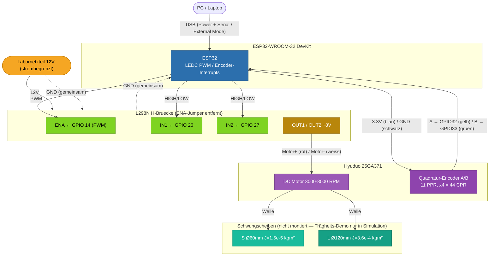

# Hardware-Diagramm – Adaptive Control DC Motor

> **Schaltplan:** gerendert in `img/hardware.png` (aus `draw_hardware.py`).
> **Editierbare Version:** [`schaltplan.drawio`](schaltplan.drawio) — in VS Code mit der
> Extension „Draw.io Integration" (`hediet.vscode-drawio`) öffnen/bearbeiten.
> **Pin-Referenz (WireViz):** `img/wiring.png` aus [`wiring.yml`](wiring.yml) — exakte
> Pin-zu-Pin-Verdrahtung mit Drahtfarben.


### Pin-Referenz (WireViz)


## Blockdiagramm (Mermaid-Übersicht)

ESP32 wird per **USB** versorgt (Power + Serial für External Mode), **12 V** vom Labornetzteil
gehen direkt auf **L298N VM**, gemeinsame Masse.



> ⚠️ Encoder mit **3.3V** versorgen — die ESP32-GPIOs sind **nicht** 5V-tolerant
> (VCC bestimmt den Pegel der A/B-Signale).

## Standalone-Versorgung (optional, ohne PC)

Für die finale Demo ohne Laptop kann der ESP32 alternativ versorgt werden:
- **USB-Powerbank** (einfachste Variante), **oder**
- **Power-Backpack mit 12 V direkt** (Barrel-Jack 6,5–16 V) → **kein Buck nötig**.

Ein **Buck-Converter** (12 V → 5 V → VIN) wird nur gebraucht, wenn weder Powerbank noch
Backpack genutzt werden. Im Prototyp-Aufbau ist er **nicht** verbaut.

## Pinbelegung Zusammenfassung

| Signal | ESP32 GPIO | Beschreibung |
|--------|-----------|-------------|
| PWM    | 14        | LEDC-PWM → L298N ENA |
| IN1    | 26        | Motorrichtung Bit 1 |
| IN2    | 27        | Motorrichtung Bit 2 |
| Enc A  | 32        | Interrupt (×4-Quadratur) — Motordraht **gelb** (siehe Hinweis) |
| Enc B  | 33        | Interrupt (×4-Quadratur) — Motordraht **grün** (siehe Hinweis) |
| Enc VCC| 3.3V      | Motordraht **blau** |
| Enc GND| GND       | Motordraht **schwarz** |

Pins folgen Raffls am Board getestetem Modell (`code_gen_ac2.slx`, 2026-07-06);
die früheren Draft-Pins 25/18/19 sind obsolet.

> ⚠️ **Offener Lab-Punkt Drahtfarben:** Die A/B-Farbzuordnung ist unbestätigt —
> `BOM.md` sagt A = grün, B = gelb (Datenblatt-Foto); dieses Diagramm sowie
> `schaltplan.drawio`/`draw_hardware.py` sagen A = gelb, B = grün. Im Lab per
> Drehrichtungs-Vorzeichen-Test verifizieren (TESTPLAN Stufe 2), nicht raten.

## Richtungslogik L298N

| IN1 | IN2 | Motor |
|-----|-----|-------|
| HIGH | LOW  | Vorwärts |
| LOW  | HIGH | Rückwärts |
| LOW  | LOW  | Freilauf |
| HIGH | HIGH | Bremse |

## Spannungshinweis

L298N hat ~4V Spannungsabfall → bei 12V Eingang kommen **~8V** am Motor an.

```
u(k) ∈ [−255, 255]  →  PWM duty [0..255] + IN1/IN2 für Vorzeichen
```
