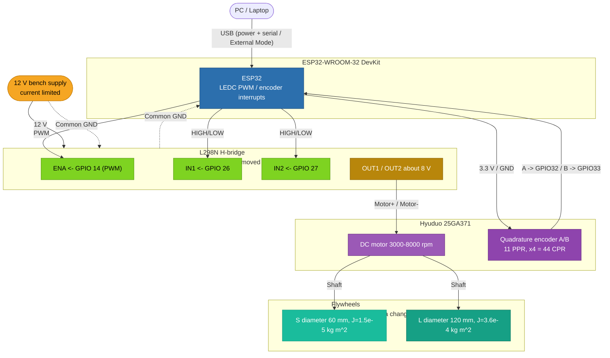

# Hardware Diagram - Adaptive Control DC Motor

The rendered schematic is [`img/hardware.png`](img/hardware.png), generated from [`draw_hardware.py`](draw_hardware.py). The editable Draw.io source is [`schaltplan.drawio`](schaltplan.drawio). The pin-to-pin reference is generated from [`wiring.yml`](wiring.yml) as [`img/wiring.png`](img/wiring.png).


## Pin Reference


## Block Diagram

The ESP32 is supplied through USB for power and External Mode communication. The current-limited 12 V bench supply feeds the L298N VM input directly, and all modules share a common ground.



Power the encoder from **3.3 V only**. The ESP32 GPIOs are not 5 V tolerant.

## Optional Stand-Alone Supply

For operation without a laptop, the ESP32 can be supplied either from a USB power bank or from the power shield with 12 V at its barrel jack. A separate buck converter is only needed when neither of these options is used; it is not fitted in the prototype.

## Pin Assignment

| Signal | ESP32 GPIO | Description |
|---|---:|---|
| PWM | 14 | LEDC PWM to L298N ENA |
| IN1 | 26 | Motor direction bit 1 |
| IN2 | 27 | Motor direction bit 2 |
| Encoder A | 32 | Interrupt input, x4 quadrature |
| Encoder B | 33 | Interrupt input, x4 quadrature |
| Encoder VCC | 3.3 V | Encoder supply |
| Encoder GND | GND | Encoder ground |

The active pin assignment is GPIO 14/26/27/32/33. Earlier draft pins 25/18/19 are obsolete.

## L298N Direction Logic

| IN1 | IN2 | Motor state |
|---|---|---|
| HIGH | LOW | Forward |
| LOW | HIGH | Reverse |
| LOW | LOW | Coast |
| HIGH | HIGH | Brake |

## Voltage Note

The L298N drops about 4 V, so a 12 V input gives about 8 V at the motor terminals.

```text
u(k) in [-255, 255] -> PWM duty [0..255] plus IN1/IN2 sign mapping
```
