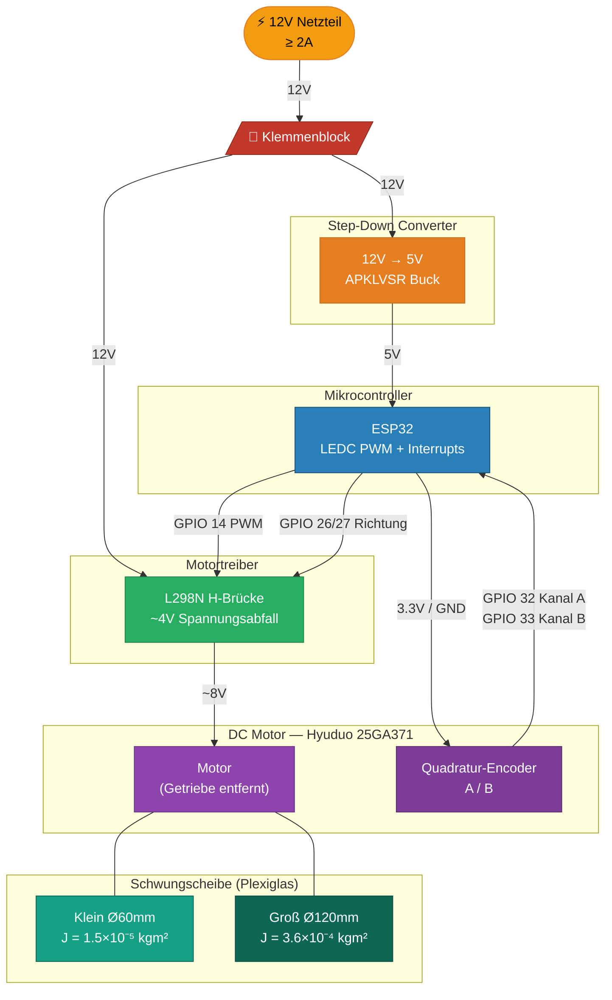
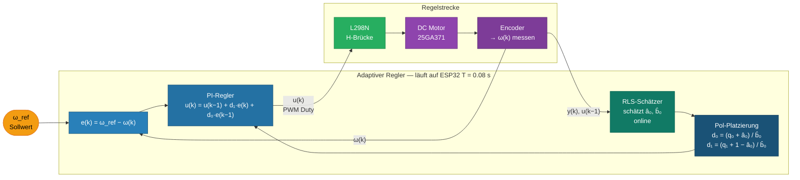

# Präsentation – Diagramme & Inhalte
## Adaptive Control of a DC Motor (Example 7.6)

> **Workflow für PowerPoint**: Mermaid-Code auf https://mermaid.live einfügen
> → rechts oben "PNG" oder "SVG" herunterladen → in Folie einfügen

---

## Diagramm 1 – Hardware-Aufbau

---

## Diagramm 2 – Adaptiver Regelkreis (Algorithmus)

---

## Komponentenliste

| # | Komponente | Modell | Funktion | Schlüsselparameter |
|---|---|---|---|---|
| E1 | DC Motor + Encoder | Hyuduo 25GA371 | Regelstrecke + Drehzahlmessung | 12V, Quadratur-Encoder, Getriebe entfernt |
| E2 | Mikrocontroller | ESP32 DevKit | Regler, RLS, PWM-Ausgabe | 240 MHz, LEDC PWM, 2× Interrupt-GPIO |
| E3 | Motortreiber | L298N H-Brücke | Motoransteuerung bidirektional | 5–35V, 2A, ~4V Spannungsabfall |
| E4 | Step-Down Converter | APKLVSR Buck | 12V → 5V für ESP32 | 4–40V Eingang, 3A |
| E5 | Klemmenblock | — | Spannungsverteilung 12V | — |
| P1 | Schwungscheibe S | Plexiglas Ø60×10mm | Kleines Massenträgheitsmoment | J = 1.5×10⁻⁵ kgm² |
| P2 | Schwungscheibe L | Plexiglas Ø120×15mm | Großes Massenträgheitsmoment | J = 3.6×10⁻⁴ kgm² |
| P3 | Grundplatte | Plexiglas 200×150×12mm | Träger für alle Komponenten | — |

**Demo-Kern**: Durch Wechsel von Schwungscheibe S → L ändert sich J um Faktor **24** → RLS erkennt die Parameteränderung und der Regler passt sich automatisch an — ohne manuellen Eingriff.

---

## Foliengliederung (Vorschlag)

1. **Titel** – Adaptive Control of a DC Motor
2. **Aufgabenstellung** – Warum adaptiv? Problem der unbekannten / sich ändernden Parameter
3. **Systemmodell** – G(s) = Km/J / (s + b/J) → diskretisiert → a₀, b₀
4. **Algorithmus** – Diagramm 2 (Regelkreis)
5. **Hardware** – Diagramm 1 + Komponentenliste
6. **Demo-Plan** – Schwungscheibe S → Regler läuft → Scheibe wechseln → Adaptation beobachten
7. **Zeitplan / Status** – Was fertig, was noch offen (H-Brücke ausstehend)
